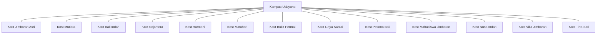
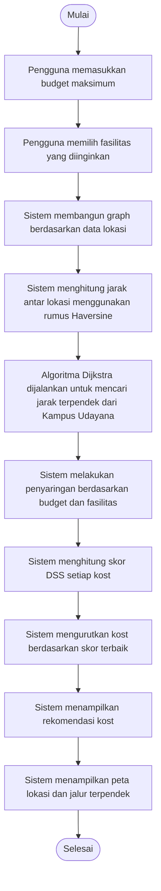
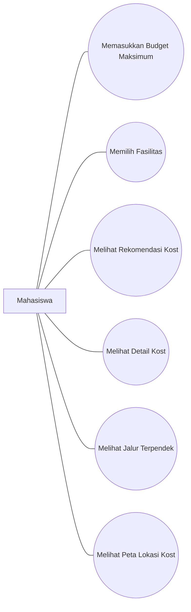

# BAB 1 PENDAHULUAN
## 1.1 Latar Belakang
Mahasiswa yang merantau untuk menempuh pendidikan di Universitas Udayana memerlukan tempat tinggal yang nyaman dan sesuai dengan kebutuhan mereka. Banyaknya pilihan kost di sekitar kampus sering kali membuat mahasiswa kesulitan dalam menentukan kost yang paling sesuai berdasarkan faktor jarak, harga, fasilitas, dan kualitas tempat tinggal.

Perkembangan teknologi memungkinkan pemanfaatan Sistem Pendukung Keputusan (Decision Support System/DSS) untuk membantu pengguna dalam memilih alternatif terbaik berdasarkan kriteria tertentu. Salah satu pendekatan yang dapat digunakan adalah struktur data Graph yang mampu merepresentasikan hubungan antar lokasi serta algoritma Dijkstra untuk menentukan jarak terpendek dari kampus menuju lokasi kost.

Berdasarkan permasalahan tersebut, dibuat sebuah aplikasi DSS Pemilihan Kost di sekitar Universitas Udayana menggunakan Python, Streamlit, dan Folium Maps. Sistem ini diharapkan dapat membantu mahasiswa memperoleh rekomendasi kost yang sesuai dengan kebutuhan secara cepat dan objektif.

## 1.2 Rumusan Masalah
1. Bagaimana menerapkan struktur data Graph pada sistem pemilihan kost?
2. Bagaimana menerapkan algoritma Dijkstra untuk mencari jarak terpendek dari kampus ke lokasi kost?
3. Bagaimana membangun sistem pendukung keputusan yang mampu memberikan rekomendasi kost berdasarkan harga, fasilitas,            rating, dan jarak?

## 1.3 Tujuan
1. Agar dapat menerapkan struktur data Graph pada sistem pemilihan kost.
2. Agar dapat mengimplementasikan algoritma Dijkstra untuk menentukan jarak terpendek dari kampus ke kost.
3. Agar dapat membangun sistem pendukung keputusan yang dapat memberikan rekomendasi kost sesuai kebutuhan pengguna.

## 1.4 Manfaat
1. Memberikan pemahaman mengenai penerapan struktur data graph dalam merepresentasikan hubungan antar lokasi kampus dan kost    sehingga memudahkan proses pencarian informasi lokasi.
2. Membantu pengguna mengetahui jarak terpendek dari Kampus Udayana menuju lokasi kost sehingga dapat mempertimbangkan          efisiensi waktu dan akses menuju kampus.
3. Membantu mahasiswa dalam menentukan pilihan kost yang sesuai berdasarkan kriteria harga, fasilitas, jarak, dan rating        sehingga proses pengambilan keputusan menjadi lebih cepat dan objektif.

# BAB 2 DASAR TEORI
## 2.1 Struktur Data Graph
Graph merupakan salah satu struktur data non-linear yang digunakan untuk merepresentasikan hubungan antara suatu objek dengan objek lainnya. Struktur data graph terdiri dari sekumpulan simpul (vertex atau node) dan sisi (edge) yang menghubungkan simpul-simpul tersebut. Graph banyak digunakan dalam berbagai bidang seperti jaringan komputer, sistem navigasi, media sosial, dan sistem informasi geografis.

Node merupakan titik yang mewakili suatu objek atau entitas, sedangkan edge merupakan hubungan yang menghubungkan dua node. Pada graph berbobot (weighted graph), setiap edge memiliki nilai atau bobot tertentu yang dapat merepresentasikan jarak, biaya, waktu, atau nilai lainnya.

Berdasarkan arah hubungan antar node, graph dibedakan menjadi dua jenis yaitu graph berarah (directed graph) dan graph tidak berarah (undirected graph). Pada graph berarah, hubungan antar node memiliki arah tertentu, sedangkan pada graph tidak berarah hubungan dapat dilalui ke dua arah. Selain itu, graph juga dapat diklasifikasikan menjadi graph berbobot (weighted graph) dan graph tidak berbobot (unweighted graph).

## 2.2 Decision Support System (DSS)
Decision Support System (DSS) atau Sistem Pendukung Keputusan merupakan sistem berbasis komputer yang dirancang untuk membantu proses pengambilan keputusan dengan memanfaatkan data, model, dan metode analisis tertentu. DSS berfungsi sebagai alat bantu bagi pengguna dalam mengevaluasi berbagai alternatif sehingga dapat menghasilkan keputusan yang lebih tepat dan objektif.

Tujuan utama DSS adalah membantu pengguna dalam menyelesaikan permasalahan yang bersifat semi terstruktur maupun tidak terstruktur. DSS tidak menggantikan peran pengambil keputusan, melainkan memberikan informasi dan rekomendasi yang dapat digunakan sebagai bahan pertimbangan dalam menentukan pilihan terbaik.

DSS memiliki beberapa karakteristik, yaitu mampu mengolah data dalam jumlah besar, mendukung proses analisis, memberikan alternatif solusi, serta memungkinkan interaksi langsung antara pengguna dengan sistem. Dengan karakteristik tersebut, DSS banyak diterapkan pada bidang pendidikan, kesehatan, bisnis, industri, dan pemerintahan.

Secara umum, DSS terdiri dari tiga komponen utama. Komponen pertama adalah data management yang berfungsi untuk menyimpan dan mengelola data yang digunakan oleh sistem. Komponen kedua adalah model management yang digunakan untuk melakukan proses analisis dan perhitungan terhadap data. Komponen ketiga adalah user interface yang berfungsi sebagai media interaksi antara pengguna dan sistem.

## 2.3 Algoritma Dijkstra
Algoritma Dijkstra merupakan algoritma pencarian jalur terpendek (shortest path algorithm) yang diperkenalkan oleh Edsger W. Dijkstra pada tahun 1956. Algoritma ini digunakan untuk mencari jalur dengan total bobot terkecil dari suatu titik awal menuju titik tujuan pada graph berbobot yang memiliki bobot non-negatif.

Prinsip kerja algoritma Dijkstra adalah memilih node yang memiliki jarak sementara paling kecil dari titik awal, kemudian memperbarui jarak ke node-node tetangganya. Proses tersebut dilakukan secara berulang hingga seluruh node dalam graph telah diproses dan diperoleh jalur terpendek menuju setiap node.

Langkah-langkah algoritma Dijkstra dimulai dengan menentukan node awal dan memberikan nilai jarak 0 pada node tersebut. Selanjutnya seluruh node lain diberi nilai tak hingga (∞). Algoritma kemudian memilih node dengan jarak terkecil, menghitung jarak baru ke node tetangganya, dan memperbarui nilai jarak apabila ditemukan jalur yang lebih pendek. Proses ini terus dilakukan hingga semua node telah dikunjungi.

Algoritma Dijkstra memiliki beberapa kelebihan, antara lain mampu menemukan jalur terpendek secara optimal, mudah diimplementasikan, dan memiliki tingkat akurasi yang tinggi pada graph berbobot non-negatif. Namun, algoritma ini memiliki keterbatasan yaitu kurang efektif untuk graph yang memiliki bobot negatif.

# BAB 3 ANALISIS dan PERANCANGAN
## 3.1 Analisis Masalah
Mahasiswa yang merantau untuk menempuh pendidikan di Universitas Udayana memerlukan tempat tinggal yang sesuai dengan kebutuhan dan kemampuan finansial. Banyaknya pilihan kost di sekitar kampus sering kali membuat mahasiswa kesulitan dalam menentukan pilihan yang tepat karena harus mempertimbangkan berbagai faktor seperti jarak, harga, fasilitas, dan kualitas kost.

Proses pencarian kost secara manual membutuhkan waktu yang cukup lama karena pengguna harus membandingkan setiap alternatif satu per satu. Selain itu, pengguna sering mengalami kesulitan dalam menentukan kost yang memiliki lokasi paling dekat dengan kampus serta sesuai dengan budget yang dimiliki.

Berdasarkan permasalahan tersebut, diperlukan sebuah Sistem Pendukung Keputusan (DSS) yang mampu membantu pengguna dalam memilih kost terbaik. Sistem ini memanfaatkan struktur data graph untuk merepresentasikan hubungan antar lokasi serta algoritma Dijkstra untuk menentukan jarak terpendek dari Kampus Udayana menuju lokasi kost.

## 3.2 Desain Graph
Desain graph digunakan untuk merepresentasikan hubungan antara Kampus Udayana dan lokasi kost yang tersedia dalam sistem. Setiap lokasi direpresentasikan sebagai node (simpul), sedangkan hubungan antar lokasi direpresentasikan sebagai edge (sisi). Setiap edge memiliki bobot berupa jarak antar lokasi yang dihitung menggunakan rumus Haversine berdasarkan koordinat latitude dan longitude.

### 3.2.1 Node
Node yang digunakan dalam sistem terdiri dari:
- Kampus Udayana
- Kost Jimbaran Asri
- Kost Mutiara
- Kost Bali Indah
- Kost Sejahtera
- Kost Harmoni
- Kost Matahari
- Kost Bukit Permai
- Kost Griya Santai
- Kost Pesona Bali
- Kost Mahasiswa Jimbaran
- Kost Nusa Indah
- Kost Villa Jimbaran
- Kost Tirta Sari

### 3.2.2 Edge
Edge digunakan untuk menghubungkan node satu dengan node lainnya. Bobot setiap edge berupa jarak antar lokasi dalam satuan kilometer yang dihitung menggunakan rumus Haversine.

**Representasi Graph :**

Gambar di atas menunjukkan representasi graph yang digunakan dalam sistem. Kampus Udayana berperan sebagai node awal (starting node) dalam proses pencarian jalur terpendek menggunakan algoritma Dijkstra, sedangkan seluruh lokasi kost menjadi node tujuan yang akan dievaluasi oleh sistem.

## 3.3 Flowchart

## 3.4 Use Case
## 3.4 Use Case

Use Case Diagram digunakan untuk menggambarkan interaksi antara pengguna dengan sistem DSS Pemilihan Kost. Pada sistem ini terdapat satu aktor yaitu **Pengguna** yang berinteraksi langsung dengan sistem untuk memperoleh rekomendasi kost.

Aktor :
* Pengguna (Mahasiswa)

### 3.4.1 Tabel Use Case
| No | Use Case                 | Deskripsi                                                                                                     |
| -- | ------------------------ | ------------------------------------------------------------------------------------------------------------- |
| 1  | Memasukkan Budget        | Pengguna memasukkan budget maksimum yang dapat digunakan untuk menyewa kost.                                  |
| 2  | Memilih Fasilitas        | Pengguna memilih fasilitas yang diinginkan seperti WiFi, AC, Dapur, Parkir, atau Laundry.                     |
| 3  | Melihat Rekomendasi Kost | Sistem menampilkan daftar kost yang sesuai dengan kriteria pengguna berdasarkan perhitungan DSS.              |
| 4  | Melihat Detail Kost      | Pengguna dapat melihat informasi detail kost seperti harga, fasilitas, rating, dan deskripsi.                 |
| 5  | Melihat Peta Lokasi      | Pengguna dapat melihat lokasi kost pada peta OpenStreetMap.                                                   |
| 6  | Melihat Jalur Terpendek  | Pengguna dapat melihat jalur terpendek dari Kampus Udayana menuju lokasi kost berdasarkan algoritma Dijkstra. |

### 3.4.2 Diagram Use Case

## 3.5 Struktur Node dan Edge
Struktur node dan edge digunakan untuk membangun graph yang merepresentasikan hubungan antara Kampus Udayana dan lokasi kost yang tersedia. Graph tersebut menjadi dasar dalam proses pencarian jarak terpendek menggunakan algoritma Dijkstra.

### 3.5.1 Struktur Node
Node merupakan representasi dari setiap lokasi yang terdapat pada sistem. Setiap node menyimpan informasi mengenai lokasi kost maupun kampus.

Atribut yang dimiliki setiap node dapat dilihat pada tabel berikut.
| Atribut   | Tipe Data | Keterangan                      |
| --------- | --------- | ------------------------------- |
| nama      | String    | Nama lokasi                     |
| tipe      | String    | Jenis lokasi (kampus atau kost) |
| lat       | Float     | Koordinat latitude              |
| lon       | Float     | Koordinat longitude             |
| harga     | Integer   | Harga kost per bulan            |
| fasilitas | String    | Fasilitas yang tersedia         |
| rating    | Float     | Rating kost                     |
| deskripsi | String    | Deskripsi lokasi                |

Contoh data node:
| Nama               | Tipe   | Latitude | Longitude |
| ------------------ | ------ | -------- | --------- |
| Kampus Udayana     | Kampus | -8.7975  | 115.1686  |
| Kost Jimbaran Asri | Kost   | -8.7920  | 115.1720  |
| Kost Mutiara       | Kost   | -8.8010  | 115.1750  |

### 3.5.2 Struktur Edge
Edge merupakan hubungan yang menghubungkan dua node pada graph. Setiap edge memiliki bobot berupa jarak antar lokasi yang dihitung menggunakan rumus Haversine.

Atribut edge dapat dilihat pada tabel berikut.
| Atribut     | Tipe Data | Keterangan              |
| ----------- | --------- | ----------------------- |
| node_asal   | String    | Lokasi awal             |
| node_tujuan | String    | Lokasi tujuan           |
| bobot       | Float     | Jarak antar lokasi (km) |

Contoh data edge:
| Node Asal      | Node Tujuan        | Bobot (km) |
| -------------- | ------------------ | ---------- |
| Kampus Udayana | Kost Jimbaran Asri | 0,73       |
| Kampus Udayana | Kost Mutiara       | 0,84       |
| Kampus Udayana | Kost Bali Indah    | 1,12       |

Pada sistem ini seluruh node saling terhubung sehingga membentuk graph berbobot (weighted graph). Bobot pada setiap edge digunakan oleh algoritma Dijkstra untuk menentukan jalur terpendek dari Kampus Udayana menuju lokasi kost yang tersedia.

# BAB 4 IMPLEMENTASI
## 4.1 Implementasi Program
Implementasi program dilakukan menggunakan bahasa pemrograman Python dengan framework Streamlit sebagai antarmuka pengguna. Sistem dibangun untuk membantu mahasiswa dalam memilih kost yang sesuai berdasarkan jarak dari kampus, harga sewa, fasilitas yang tersedia, dan rating kost.

Data lokasi kampus dan kost disimpan dalam struktur data dictionary yang berisi informasi nama lokasi, koordinat, harga, fasilitas, rating, dan deskripsi. Selanjutnya data tersebut digunakan untuk membentuk graph berbobot yang menghubungkan setiap lokasi.

Bobot pada graph dihitung menggunakan rumus Haversine berdasarkan koordinat latitude dan longitude. Setelah graph terbentuk, algoritma Dijkstra digunakan untuk mencari jarak terpendek dari Kampus Udayana menuju setiap lokasi kost.

Sistem juga menerapkan metode Decision Support System (DSS) untuk menentukan rekomendasi kost terbaik. Perhitungan DSS dilakukan dengan mempertimbangkan faktor jarak, harga, dan rating. Pengguna dapat menentukan budget maksimum serta fasilitas yang diinginkan sehingga sistem dapat menampilkan rekomendasi yang sesuai dengan kebutuhan.

Selain menampilkan rekomendasi dalam bentuk daftar, sistem juga menampilkan visualisasi lokasi menggunakan peta digital OpenStreetMap melalui library Folium.

## 4.2 Penjelasan Kode
### 4.2.1 Import Library
Pada bagian awal program dilakukan import beberapa library yang digunakan untuk mendukung jalannya sistem.

```python
import streamlit as st
import folium
from streamlit_folium import st_folium
import heapq
from collections import defaultdict
import math
import pandas as pd
```
Fungsi masing-masing library adalah sebagai berikut:
| Library          | Fungsi                                    |
| ---------------- | ----------------------------------------- |
| Streamlit        | Membuat antarmuka sistem berbasis web     |
| Folium           | Menampilkan peta digital                  |
| Streamlit Folium | Menghubungkan Folium dengan Streamlit     |
| Heapq            | Mendukung implementasi algoritma Dijkstra |
| Defaultdict      | Menyimpan struktur graph                  |
| Math             | Perhitungan matematis                     |
| Pandas           | Menampilkan data dalam bentuk tabel       |

### 4.2.2 Data Lokasi
Data lokasi disimpan dalam variabel `LOKASI` yang berbentuk dictionary. Data ini berisi informasi kampus dan kost yang digunakan dalam sistem.

Setiap lokasi memiliki beberapa atribut yaitu:
* tipe
* latitude
* longitude
* harga
* fasilitas
* rating
* deskripsi

Data tersebut digunakan sebagai dasar pembentukan graph dan proses rekomendasi kost.

### 4.2.3 Fungsi Haversine
Fungsi Haversine digunakan untuk menghitung jarak antara dua titik koordinat berdasarkan latitude dan longitude.

```python
def haversine(lat1, lon1, lat2, lon2):
```
Hasil perhitungan jarak digunakan sebagai bobot pada edge graph sehingga sistem dapat mengetahui jarak antar lokasi secara lebih akurat.

### 4.2.4 Class Graph
Class Graph digunakan untuk membangun struktur data graph.

```python
class Graph:
```
Class ini memiliki beberapa fungsi utama:
* `tambah_edge()` untuk menambahkan hubungan antar node.
* `dijkstra()` untuk mencari jarak terpendek.
* `ambil_jalur()` untuk menampilkan jalur yang dilalui.

### 4.2.5 Pembuatan Graph
Graph dibangun menggunakan fungsi:

```python
def buat_graph():
```
Fungsi ini menghubungkan seluruh lokasi dan menghitung bobot setiap edge menggunakan rumus Haversine.

### 4.2.6 Algoritma Dijkstra
Algoritma Dijkstra digunakan untuk menentukan jarak terpendek dari Kampus Udayana menuju seluruh lokasi kost.

```python
dist, prev = graph.dijkstra("Kampus Udayana")
```
Hasil yang diperoleh berupa:
* Jarak minimum menuju setiap kost.
* Jalur yang dilalui menuju kost tersebut.

### 4.2.7 Sistem Rekomendasi DSS
Fungsi rekomendasi digunakan untuk menentukan urutan kost terbaik berdasarkan kriteria yang dipilih pengguna.

```python
def rekomendasikan(dist, prev, budget_max, fasilitas_filter):
```
Proses yang dilakukan meliputi:
1. Menyaring kost berdasarkan budget.
2. Menyaring kost berdasarkan fasilitas.
3. Mengambil hasil jarak dari Dijkstra.
4. Menghitung skor DSS.
5. Mengurutkan kost berdasarkan skor terbaik.

### 4.2.8 Visualisasi Peta
Visualisasi peta dibuat menggunakan Folium.

```python
def buat_peta():
```
Peta menampilkan:
* Lokasi Kampus Udayana.
* Lokasi seluruh kost.
* Jalur rekomendasi terbaik.
* Informasi detail setiap kost.

### 4.2.9 Antarmuka Pengguna
Antarmuka sistem dibangun menggunakan Streamlit.

Komponen yang digunakan meliputi:
* Slider budget.
* Pilihan fasilitas.
* Daftar rekomendasi kost.
* Peta lokasi.
* Tabel hasil algoritma Dijkstra.
Melalui antarmuka ini pengguna dapat berinteraksi langsung dengan sistem untuk memperoleh rekomendasi kost sesuai kebutuhan.

# BAB 5 PENGUJIAN DAN ANALISIS
## 5.1 Skenario Pengujian
Pengujian dilakukan untuk memastikan bahwa Sistem Pendukung Keputusan (Decision Support System/DSS) pemilihan kost di sekitar Universitas Udayana dapat berjalan sesuai dengan tujuan perancangan. Pengujian mencakup validasi fitur utama sistem, yaitu penyaringan berdasarkan anggaran (budget), penyaringan berdasarkan fasilitas, perhitungan jarak menggunakan algoritma Dijkstra, pemberian rekomendasi kost berdasarkan skor penilaian yang telah ditentukan, serta visualisasi lokasi pada peta.

detail lebih lengkap ada pada video dibawah ini : 

[Sistem Rekomandasi Kost di Drive](https://drive.google.com/file/d/1P1fgAaam-yd9ZSG-HiEo9kGAZRZdhmdD/view?usp=drive_link)

atau

[Sistem Rekomandasi Kost di Youtube](https://youtu.be/sxUQrldBZkk)

## 5.2 Analisis Hasil
Berdasarkan hasil pengujian yang telah dilakukan, sistem pendukung keputusan pemilihan kost di sekitar Universitas Udayana mampu menjalankan seluruh fungsi utama sesuai dengan kebutuhan pengguna. Sistem berhasil melakukan penyaringan data kost berdasarkan anggaran dan fasilitas yang dipilih, sehingga pengguna dapat memperoleh daftar kost yang sesuai dengan kebutuhannya.

Penggunaan struktur data graph memungkinkan hubungan antar lokasi direpresentasikan dengan baik. Setiap kost direpresentasikan sebagai vertex (node), sedangkan hubungan antar lokasi direpresentasikan sebagai edge yang memiliki bobot berupa jarak geografis. Pendekatan ini memberikan dasar yang kuat bagi penerapan algoritma Dijkstra dalam menghitung jarak terpendek.

Penggunaan algoritma Dijkstra terbukti mampu menentukan jarak terpendek dari Universitas Udayana menuju setiap alternatif kost. Informasi jarak tersebut kemudian dikombinasikan dengan faktor harga dan rating untuk menghasilkan skor rekomendasi yang digunakan dalam proses pengambilan keputusan.

Hasil rekomendasi yang diberikan sistem dapat membantu pengguna dalam memilih kost secara lebih cepat dibandingkan melakukan pencarian dan perbandingan secara manual. Selain itu, visualisasi peta yang disediakan membantu pengguna mengetahui lokasi kost secara lebih jelas.

## 5.3 Kompleksitas Algoritma
Sistem menggunakan algoritma Dijkstra untuk menentukan jarak terpendek dari node Universitas Udayana menuju node kost yang tersedia pada graph. Implementasi algoritma menggunakan struktur data priority queue yang disediakan oleh library heapq pada Python.

### 5.3.1 Kompleksitas Pembentukan Graph
Pada tahap awal, sistem membangun graph yang berisi 14 node yang terdiri dari 1 lokasi kampus dan 13 lokasi kost. Setiap node dihubungkan dengan node lainnya menggunakan bobot jarak yang dihitung menggunakan rumus Haversine.

Karena setiap node dibandingkan dengan seluruh node lainnya, maka kompleksitas waktu pembentukan graph adalah:
```
O(V^2)
```
dengan V adalah jumlah vertex pada graph.

---

### 5.3.2 Kompleksitas Algoritma Dijkstra

Proses pencarian jarak terpendek menggunakan algoritma Dijkstra dengan bantuan priority queue (`heapq`).
```
O((V+E)\log V)
```
dengan:
* V = jumlah vertex
* E = jumlah edge
Kompleksitas ini menunjukkan bahwa algoritma tetap efisien meskipun jumlah node bertambah.

---

### 5.3.3 Kompleksitas Sistem Rekomendasi
Setelah jarak diperoleh, sistem melakukan proses filtering dan perhitungan skor terhadap seluruh alternatif kost.

Jika terdapat n data kost, maka sistem perlu memeriksa setiap kost satu kali untuk:
* mengecek budget,
* mengecek fasilitas,
* menghitung skor rekomendasi.

Kompleksitas waktu proses ini adalah:
```
O(n)
```
karena setiap alternatif hanya diproses satu kali.

# BAB 6 KESIMPULAN DAN SARAN
## 6.1 Kesimpulan
Berdasarkan hasil perancangan, implementasi, dan pengujian yang telah dilakukan, dapat disimpulkan bahwa Sistem Pendukung Keputusan (Decision Support System/DSS) untuk pemilihan kost di sekitar Universitas Udayana berhasil dikembangkan menggunakan struktur data graph dan algoritma Dijkstra. Sistem mampu membantu pengguna dalam memperoleh informasi serta rekomendasi kost berdasarkan beberapa kriteria yang telah ditentukan.

Struktur data graph berhasil digunakan untuk merepresentasikan hubungan antara lokasi Universitas Udayana dan lokasi kost yang tersedia. Setiap lokasi direpresentasikan sebagai node (vertex), sedangkan hubungan antar lokasi direpresentasikan sebagai edge yang memiliki bobot berupa jarak geografis. Representasi ini memungkinkan proses pencarian jarak dilakukan secara terstruktur dan efisien.

Algoritma Dijkstra berhasil diterapkan untuk menghitung jarak terpendek dari Universitas Udayana menuju seluruh alternatif kost yang tersedia. Berdasarkan hasil pengujian, algoritma mampu menghasilkan informasi jarak secara akurat yang kemudian digunakan sebagai salah satu faktor dalam proses pengambilan keputusan.

Selain itu, sistem mampu melakukan penyaringan data berdasarkan budget dan fasilitas yang dipilih pengguna. Hasil rekomendasi yang diberikan telah mempertimbangkan kombinasi faktor jarak, harga, dan rating sehingga dapat membantu pengguna dalam menentukan pilihan kost yang sesuai dengan kebutuhan.

Dengan demikian, tujuan utama penelitian dan pengembangan sistem ini telah berhasil dicapai, yaitu menyediakan sistem pendukung keputusan yang dapat membantu mahasiswa dalam memilih kost secara lebih efektif, efisien, dan objektif.

## 6.2 Saran
Meskipun sistem yang dikembangkan telah mampu menjalankan fungsi utama dengan baik, masih terdapat beberapa hal yang dapat dikembangkan pada penelitian atau pengembangan selanjutnya.

1. Menambahkan data kost yang lebih banyak dan lebih beragam sehingga hasil rekomendasi yang diberikan dapat mencakup lebih banyak alternatif pilihan bagi pengguna.
2. Mengintegrasikan sistem dengan basis data atau layanan online sehingga informasi harga, fasilitas, dan ketersediaan kost dapat diperbarui secara otomatis tanpa perlu dilakukan secara manual.
3. Menambahkan fitur penyesuaian bobot kriteria sehingga pengguna dapat menentukan tingkat prioritas masing-masing faktor, seperti harga, jarak, maupun rating sesuai dengan preferensi pribadi.
4. Mengembangkan antarmuka pengguna yang lebih interaktif dan responsif agar pengalaman penggunaan sistem menjadi lebih nyaman.
5. Melakukan perbandingan dengan algoritma pencarian atau metode pengambilan keputusan lainnya untuk mengetahui metode yang memberikan hasil paling optimal pada kasus pemilihan kost.
6. Menambahkan fitur navigasi dan integrasi dengan layanan peta digital sehingga pengguna dapat memperoleh petunjuk arah secara langsung menuju lokasi kost yang dipilih.
